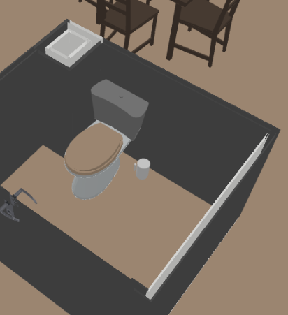
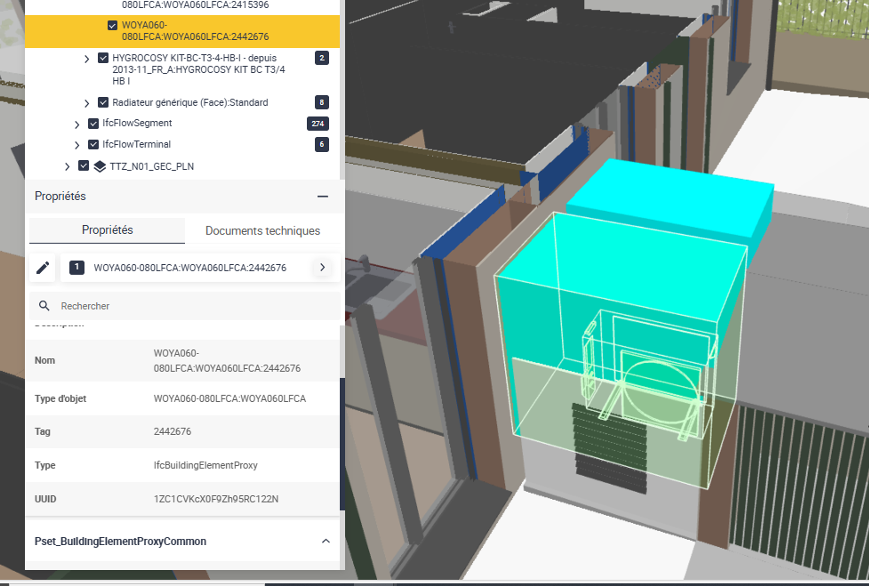

[](https://creativecommons.org/licenses/by-sa/4.0/)

# Spécification — Visionneuse IFC avec Analyse Spatiale

> Version 4.6 — Avril 2026  
> Statut : Référence de développement

---

## Table des matières

1. [Vision & Concept](#1-vision--concept)
2. [Principes d'architecture](#2-principes-darchitecture)
3. [Fichier projet encapsulé](#3-fichier-projet-encapsulé)
4. [Chargement & Fédération](#4-chargement--fédération)
5. [Moteur géométrique](#5-moteur-géométrique)
6. [Sélection libre de zone d'analyse](#6-sélection-libre-de-zone-danalyse)
7. [Moteur de règles](#7-moteur-de-règles)
8. [Éditeur de règles](#8-éditeur-de-règles)
9. [Visualisation 3D](#9-visualisation-3d)
10. [Recherche & Navigation](#10-recherche--navigation)
11. [Annotations](#11-annotations)
12. [Géoréférencement & Carte](#12-géoréférencement--carte)
13. [Comparaison de versions](#13-comparaison-de-versions)
14. [Ajout & Modification de paramètres](#14-ajout--modification-de-paramètres)
15. [Résultats & Exports](#15-résultats--exports)
16. [Historique des analyses](#16-historique-des-analyses)
17. [Couche IA](#17-couche-ia)
    - [17.0 Le moteur comme environnement d'outils pour l'IA](#170-le-moteur-comme-environnement-doutils-pour-lia)
    - [17.1 Paradigme — l'IA comme expert](#171-paradigme--lia-comme-expert)
    - [17.2 Reconnaissance visuelle](#172-reconnaissance-visuelle)
    - [17.3 Agent de Vérification Intelligent](#173-agent-de-vérification-intelligent)
    - [17.4 Interface IA](#174-interface-ia)
18. [Contraintes de performance](#18-contraintes-de-performance)
19. [Accès & Sauvegarde](#19-accès--sauvegarde)
20. [Licences](#20-licences)
21. [Glossaire](#21-glossaire)

---

## 1. Vision & Concept

### Principe fondamental

> Un fichier IFC est une carte. Chaque objet possède une **définition** (ce qu'il est) et une **position** (où il est). L'analyse consiste à comparer, regrouper et mesurer ces objets selon leurs positions et leurs relations spatiales.

La visionneuse adopte une logique **SIG (Système d'Information Géographique)** appliquée au bâtiment.

| SIG | Cette visionneuse |
|---|---|
| Carte géographique | Maquette IFC |
| Couches (routes, bâtiments…) | Disciplines (ARC, ELEC, STR…) |
| Objet avec coordonnées | Objet IFC avec position |
| Analyse spatiale | Vérifications sur les objets |

### Paradigme différenciateur

| Visionneuses classiques | Cette visionneuse |
|---|---|
| Interrogation par propriétés déclarées | Analyse par géométrie et position |
| Dépend du soin du modeleur | Fonctionne même si les propriétés sont absentes |
| Requête statique sur attributs | Inférence dynamique depuis la géométrie |
| Objets analysés en isolation | Objets analysés en relation |

### Portée universelle

Le moteur n'est pas conçu pour des cas prédéfinis. Il est conçu pour **tout cas** exprimable à partir d'objets IFC, de leurs positions et de leurs relations spatiales. L'utilisateur formule une intention — le moteur et l'agent IA se chargent de la traduire en analyse, quels que soient les objets et les relations impliqués.

### Exemples illustratifs

Les exemples ci-dessous illustrent la logique du moteur. Ils ne définissent pas les limites du système.

- **Identifier les types de logements** en analysant la concomitance de pièces, murs, portes — sans que le logement soit explicitement déclaré dans le modèle
- **Compter les prises électriques par logement** en croisant les modèles ARC et ELEC par leurs positions spatiales, sans information ajoutée par l'utilisateur
- **Mesurer le linéaire de garde-corps** donnant sur un espace donné, même si le garde-corps est modélisé en un seul élément couvrant plusieurs niveaux
- **Calculer le ratio d'ouverture** d'une pièce en mettant en relation les surfaces de fenêtres et la surface de sol
- **Déduire la surface nette réelle** d'une pièce en soustrayant les emprises des objets encombrants sélectionnés par l'utilisateur
- **Vérifier la présence des équipements dans le cellier** en listant tous les objets contenus dans le volume du cellier, sans connaître leur type IFC à l'avance
- **Détecter les équipements mal dimensionnés** en croisant la référence fabricant dans le nom de l'objet IFC avec les fiches techniques réelles — un `IfcBuildingElementProxy` nommé "WOYA060LFCA" dont la bbox est 9× supérieure aux dimensions Daikin est automatiquement signalé, même sans classification précise
- **Vérifier la complétude réglementaire d'un local** en identifiant son type fonctionnel depuis son contenu (une toilette → WC), puis en vérifiant la présence de tous les éléments requis (porte, lave-mains) et la cohérence des locaux adjacents (WC non contigu à un espace de repas)

### Exemple détaillé — Vérification des équipements dans le cellier

Ce cas illustre le fonctionnement complet du moteur d'analyse spatiale.

**Étape 1 — Identifier le cellier**

Le moteur cherche un `IfcSpace` dont le nom correspond à "cellier".
- Si trouvé : le volume est extrait automatiquement
- Si absent ou mal nommé : l'utilisateur sélectionne l'espace manuellement dans la vue 3D (zone libre)

**Étape 2 — Primitive Containment**

```
POUR CHAQUE objet dans le modèle
  SI position(objet) EST CONTENUE DANS volume(cellier)
    → ajouter à la liste
```

Tous les objets physiquement dans ce volume sont remontés, sans distinction de type a priori.

**Étape 3 — Filtrage équipements**

| Entité IFC | Équipement correspondant |
|---|---|
| `IfcElectricAppliance` | Machine à laver, congélateur… |
| `IfcSanitaryTerminal` | Évier, chauffe-eau… |
| `IfcFlowTerminal` | Équipements fluides |
| `IfcFurnishingElement` | Mobilier technique |

**Étape 4 — Résultat**

- Liste des équipements présents dans le cellier
- Objets mis en surbrillance dans la vue 3D
- Exportable (PDF, Excel, BCF)

**La règle dans l'éditeur**

```
POUR CHAQUE IfcSpace WHERE nom = "cellier"
  LISTER tous objets CONTENUS DANS espace
  FILTRER catégorie = équipement
  AFFICHER résultat
```

> L'utilisateur n'a pas besoin de connaître les types IFC des équipements à l'avance. Le moteur trouve tout ce qui est physiquement dans l'espace. C'est la géométrie qui répond, pas les propriétés.

---

### Exemple détaillé — Accessibilité des équipements en chaufferie

**Contexte** : Local CHAUFFERIE / Production ECS collective  
**Règle normative** : Un espace libre d'au moins 0,50 m doit être disponible autour de chaque générateur  
**Vérification** : Tous les équipements nécessitant une maintenance sont-ils accessibles ?

**Primitives utilisées** : Détection par type + Mesure de distance + Intersection

**Logique fondamentale — Object-first**

L'intention réelle n'est pas "trouver les équipements dans un espace nommé chaufferie" mais **"vérifier que tout équipement nécessitant une maintenance est accessible"**. L'`IfcSpace` est une information secondaire, pas un prérequis. La vérification fonctionne même si aucun `IfcSpace` n'est défini.

**Étape 1 — Détection automatique des équipements de maintenance**

La détection combine deux sources complémentaires pour produire un **score de confiance composite** :

**Source A — Classification IFC**

Le moteur identifie automatiquement tous les objets selon leur type IFC déclaré :

| Entité IFC | Équipement | Confiance type |
|---|---|---|
| `IfcBoiler` | Chaudière, générateur | Haute |
| `IfcPump` | Pompe | Haute |
| `IfcHeatExchanger` | Échangeur thermique | Haute |
| `IfcCompressor` | Compresseur | Haute |
| `IfcUnitaryEquipment` | Équipement technique unitaire | Haute |
| `IfcFlowMovingDevice` | Équipements fluides actifs | Haute |
| `IfcBuildingElementProxy` | Objet sans classification | Faible |
| `IfcFlowSegment` | Peut être équipement ou tuyauterie | Moyenne |

**Source B — Reconnaissance visuelle IA (couche §17.2)**

La couche IA analyse la géométrie rendue en 3D exactement comme un ingénieur regarde la maquette. Elle peut identifier un équipement de maintenance par sa forme, ses dimensions, son contexte spatial et ses relations topologiques avec les objets voisins — **indépendamment de sa classification IFC**.

```
Rendu 3D de l'objet (+ voisins visibles)
        ↓
  Agent IA — vision
        ↓
"Chaudière murale, puissance estimée ~25 kW"  →  confiance: 0.93
        ↓
  Score composite = f(IFC_type, IA_vision, contexte_spatial)
```

**Confiance composite**

```
score = α × confiance_IFC + β × confiance_IA + γ × cohérence_spatiale
```

- `confiance_IFC` — qualité de la classification IFC déclarée (0 si non classifié, 1 si type précis)
- `confiance_IA` — confiance du modèle de vision sur le type fonctionnel reconnu
- `cohérence_spatiale` — accord entre le type reconnu et le contexte (ex: équipement dans une pièce technique = +)
- Seuil de validation automatique : configurable (défaut 0.80)
- En dessous du seuil : l'objet est présenté à l'utilisateur pour validation

Pour les objets sous le seuil de confiance, l'agent présente sa proposition et demande validation à l'utilisateur (voir §17.2).

**Étape 2 — Vérification du dégagement de 0,50 m**

Pour chaque équipement détecté, le moteur crée une **zone tampon de 0,50 m** et vérifie si elle est libre de tout objet solide.

```
DÉTECTER tous objets WHERE type = maintenance
POUR CHAQUE équipement détecté
  CRÉER buffer(équipement, 0.50m)
  SI intersection(buffer, autres_objets_solides) = vide
    → CONFORME
  SINON
    → NON CONFORME + identification de l'objet en conflit
```

**Étape 3 — Traitement parallèle des hypothèses**

L'agent traite simultanément tous les cas plausibles :

| Hypothèse | Traitement |
|---|---|
| Équipement détecté, dégagement suffisant | Conforme |
| Équipement détecté, dégagement insuffisant | Non-conformité |
| Équipement dans un espace inadéquat (bureau, logement…) | Alerte — emplacement suspect |
| Équipement sans `IfcSpace` associé | Vérifié quand même, signalé |
| Objet ambigu pouvant nécessiter maintenance | Demande de validation utilisateur |

**Étape 4 — Résultat**

- Équipements conformes / non conformes mis en surbrillance dans la vue 3D
- Objets en conflit identifiés
- Alertes pour équipements en emplacement suspect
- Exportable (PDF, Excel, BCF)

> Cette vérification est purement géométrique et indépendante du nommage des espaces. La norme définit une distance, la géométrie du modèle fournit les positions. L'`IfcSpace` est exploité comme information contextuelle secondaire, jamais comme condition bloquante.

### Les propriétés IFC en complément

La géométrie est la **source de vérité primaire**. Les propriétés déclarées dans le modèle IFC sont exploitées en **enrichissement secondaire**, comme dans les autres visionneuses.

### Conformité à la spec IFC

Toute décision technique est ancrée dans la terminologie et le schéma officiel IFC publié par **buildingSMART International** (ISO 16739). Aucune hypothèse ne sera faite hors spec. Les deux versions **IFC 2x3** et **IFC 4.3** sont supportées.

---

## 2. Principes d'architecture

### Déploiement

L'application peut être déployée en **web (navigateur)**, en **application desktop** ou en mode hybride. Le choix de la plateforme de déploiement est laissé à l'équipe de développement selon les contraintes de performance et d'usage.

### Traitement local

- Tout le traitement s'effectue **localement sur la machine de l'utilisateur** — aucun serveur requis pour l'analyse
- Aucune donnée du modèle IFC ne transite vers un serveur externe
- L'application doit fonctionner **sans connexion internet** une fois chargée

### Fonctionnalité connectée optionnelle — Reconnaissance visuelle IA

La **reconnaissance visuelle IA** (§17.2) constitue la seule exception au principe de traitement 100% local. Elle envoie des captures 3D anonymisées (pas le fichier IFC brut) à un fournisseur de vision IA :

- **Opt-in explicite** — la fonctionnalité est désactivée par défaut. L'utilisateur l'active délibérément et est informé de ce qui est transmis
- **Données transmises** : captures 3D rendues (images PNG des objets dans leur contexte), jamais le fichier IFC source
- **Fournisseur actuel** : API Claude Vision (Anthropic)
- **Évolution prévue** : intégration d'un modèle local (type Gemma 4 ou équivalent) lorsque les capacités des modèles embarqués le permettront — la fonctionnalité deviendra alors 100% locale
- **Sans connexion** : toutes les autres fonctions (parsing, analyse spatiale, moteur de règles, agent de vérification) restent pleinement opérationnelles hors ligne

### Versions IFC supportées

- **IFC 2x3** — version la plus répandue dans les fichiers réels
- **IFC 4.3** — version de référence actuelle buildingSMART
- La gestion des deux versions est transparente pour l'utilisateur

### Conçu pour le tool use via MCP

Le moteur géométrique expose ses primitives spatiales comme un **serveur MCP (Model Context Protocol)**. MCP est le protocole standard ouvert qui permet à un LLM de découvrir et d'appeler des outils externes de façon structurée — exactement comme Claude utilise `Bash`, `Read` ou `Grep` dans une session de code.

Tout LLM compatible MCP (Claude, et tout modèle adoptant le protocole) peut se connecter au serveur BIM et exécuter des vérifications complexes sur n'importe quelle maquette, sans entraînement BIM spécifique et sans développement d'intégration personnalisé.

Le serveur MCP est le **point de connexion universel** entre le moteur BIM et tout agent IA externe. Il évolue indépendamment de l'interface utilisateur.

### Indépendance technologique

La présente spécification décrit les **fonctionnalités et comportements attendus**. Les choix technologiques (langages, bibliothèques, moteurs de rendu, formats de stockage intermédiaires) sont laissés à l'équipe de développement. Aucune technologie spécifique n'est imposée par cette spec.

---

## 3. Fichier projet encapsulé

### Concept

L'utilisateur travaille avec un **fichier projet unique** qui contient tout le contexte de son analyse. L'extension est à définir (placeholder : `.bimview`).

### Contenu de l'archive

```
[nom-du-projet].[ext]
  ├── modele_ARC.ifc
  ├── modele_ELEC.ifc
  ├── modele_STR.ifc       ← tous les fichiers IFC du projet
  ├── delta.json            ← paramètres ajoutés / modifiés par l'utilisateur
  ├── regles.json           ← règles utilisateur sauvegardées
  ├── zones.json            ← zones libres définies par l'utilisateur
  ├── annotations.json      ← annotations sur les objets et zones
  └── historique.json       ← historique des sessions d'analyse
```

### Principe

- Le fichier IFC original n'est **jamais modifié**
- À l'ouverture, le moteur fusionne les IFC et le delta pour produire une vue enrichie
- Un seul fichier à partager — tout le contexte du projet est préservé

### Interopérabilité

Le format du fichier projet est **ouvert, documenté et non propriétaire** :
- Sa structure est publique et lisible par des outils tiers
- Aucune dépendance à un vendeur ou une technologie spécifique
- Importable et exportable par d'autres outils
- Aligné sur les standards ouverts existants (IFC, BCF) où pertinent

### Résilience des identifiants (GUID)

Les outils auteurs (Revit, ArchiCAD…) peuvent regénérer les identifiants uniques (GlobalId) des objets lors d'un ré-export. Or le delta, les annotations et l'historique s'accrochent à ces identifiants.

Le moteur implémente une **stratégie de réconciliation** : si un GUID ne correspond plus, l'objet est retrouvé par **empreinte composite** (Type IFC + Nom + Coordonnées spatiales). Cette stratégie garantit la continuité des données entre versions de modèle.

---

## 4. Chargement & Fédération

### Modes de chargement

- **Glisser-déposer** (drag & drop) dans l'interface
- **Sélection via explorateur de fichiers**
- Ouverture d'un **fichier projet encapsulé** (section 3)

### Modèles fédérés

- Chargement **simultané de plusieurs fichiers IFC** dès la version initiale
- Chaque modèle conserve son identité (discipline : ARC, STR, ELEC, CVC, etc.)
- L'analyse spatiale peut croiser les objets **inter-modèles**
- Prérequis de fédération : même origine, même unité, même système de coordonnées de référence (SCR)
- En cas de décalage d'origine : **recalage manuel ou automatique** (voir section 12)

### Contrainte de taille

- **500 MB maximum par fichier**
- Chargement progressif : l'interface devient utilisable avant que le fichier soit entièrement chargé

---

## 5. Moteur géométrique

### Principe

Chaque objet IFC expose sa géométrie selon le schéma buildingSMART. Le moteur extrait les **enveloppes géométriques** de chaque objet (définition + coordonnées) pour réaliser les analyses spatiales.

### Les 4 primitives spatiales fondamentales

| Primitive | Définition | Exemple d'usage |
|---|---|---|
| **Containment** | Le volume A contient l'objet B | Quelles prises sont dans ce logement ? |
| **Adjacence** | A et B partagent une face ou une frontière | Quelles fenêtres appartiennent à cet espace ? |
| **Intersection** | Les géométries de A et B se croisent | Quelle portion du garde-corps est dans cette pièce ? |
| **Mesure** | Surface, longueur, volume d'un objet ou d'un résultat | Linéaire, ratio, surface nette |

### Entités déduites

Le moteur permet de construire des **entités virtuelles** non déclarées dans le fichier IFC mais déduites de la topologie :

- **Logement** : cluster d'`IfcSpace` connectés via `IfcDoor`, délimités par une porte palière
- **Zone technique** : groupe d'objets MEP partageant un volume commun
- Toute entité définie par l'utilisateur via le moteur de règles ou la sélection libre

### Références IFC utilisées

| Entité IFC | Usage |
|---|---|
| `IfcSpace` | Volume de pièce, base de l'analyse spatiale |
| `IfcRelContainedInSpatialStructure` | Hiérarchie de containment |
| `IfcRelSpaceBoundary` | Limites entre espaces et éléments |
| `IfcRelConnects*` | Connexions physiques entre éléments |
| `IfcRelAggregates` | Décomposition d'éléments complexes |

### Gestion des tolérances géométriques

Les modèles IFC présentent des imprécisions de modélisation (joints à ±quelques mm). Le moteur intègre une **tolérance configurable** pour les calculs d'adjacence et d'intersection.

### Accélération spatiale

Pour garantir des performances en temps réel sur des modèles lourds, le moteur construit une **structure d'indexation spatiale** dès le chargement du modèle. Cette structure permet de localiser rapidement les objets dans l'espace sans tester l'intégralité du modèle à chaque requête.

### Cache des résultats spatiaux

Une fois une analyse spatiale calculée (ex : "objets contenus dans le cellier"), le résultat est **mis en cache**. Les requêtes suivantes filtrent le cache au lieu de recalculer depuis zéro. Le cache est invalidé lors de modifications du modèle ou du delta.

### Re-qualification des objets non typés

Certains objets IFC sont exportés sans type précis (équivalent d'une "boîte noire" sans catégorie). Le moteur permet leur **re-qualification sémantique via la couche delta** : l'utilisateur ou l'agent IA peut leur attribuer un type fonctionnel, ce qui permet aux règles métier de s'appliquer sur ces objets.

---

## 6. Sélection libre de zone d'analyse

### Problème couvert

Tous les regroupements pertinents ne correspondent pas à une entité IFC existante (ex : places de parking, zones de façade, tronçons de réseau). L'utilisateur peut définir **librement sa zone d'analyse**.

### Modes de sélection

| Mode | Description |
|---|---|
| **Rectangle** | Sélection rapide par boîte englobante dans la vue 3D |
| **Polygone libre** | L'utilisateur trace un contour en 3D |
| **Sélection manuelle** | L'utilisateur clique les objets qui composent la zone |

### Comportement

- La zone devient une **entité à part entière** dans le moteur d'analyse
- Elle dispose des mêmes coordonnées qu'un `IfcSpace` et peut faire l'objet des 4 primitives spatiales
- Elle est **sauvegardable** dans le fichier projet (zones.json)
- Les règles s'appliquent sur une zone libre exactement comme sur un `IfcSpace`

### Architecture

```
Source de la zone d'analyse
        ↓
IfcSpace (IFC natif)    OU    Zone libre (définie par l'utilisateur)
        ↓                              ↓
              Même moteur d'analyse
```

---

## 7. Moteur de règles

### Architecture

```
Règles prédéfinies          Règles utilisateur
      ↓                            ↓
   Catalogue                  Éditeur de règles
      ↓                            ↓
         Moteur d'exécution spatial
                  ↓
          Résultats / Rapports
```

Les deux types de règles reposent sur le **même moteur d'exécution**. Une règle prédéfinie est une règle utilisateur figée et validée.

### Règles prédéfinies

Organisées selon 3 axes de catégorisation :

**Par norme**
- Accessibilité PMR (dégagements, dimensions portes — EN 17210)
- Sécurité incendie (distances d'évacuation, compartimentage)
- Code de la construction (surfaces minimales par type de pièce)
- NF DTU (règles techniques par corps de métier)

**Par métier**
- Architecture (surfaces, ratios, typologies)
- Structure (connectivité, appuis)
- MEP — Électricité (prises, éclairage, tableaux)
- MEP — Fluides (continuité réseaux, distances)
- MEP — CVC (volumes traités, débits)

**Par usage**
- Contrôle qualité du modèle BIM (cohérence hiérarchie spatiale, objets non rattachés)
- Vérification de conformité réglementaire
- Métrés et quantitatifs
- Analyse de performance spatiale

### Famille de règles : Connectivité géométrique (GEOMETRIC_CONNECTIVITY)

#### Principe

Les fichiers IFC n'exportent généralement pas les relations de connectivité réseau (`IfcRelConnectsPortToElement`, ports de raccordement). Le moteur ne s'y fie pas. Il vérifie la connectivité **uniquement par la géométrie** : un appareil physiquement raccordé touche ou frôle son réseau. Un écart mesurable révèle un problème de modélisation.

> **Règle fondamentale** : la géométrie est la source de vérité. Les relations IFC sont des annotations optionnelles — leur absence ne bloque pas la vérification.

#### Algorithme

```
Pour chaque équipement E de type source (ex. IfcSanitaryTerminal) :

  1. Pré-filtre spatial
     candidats ← spatialIndex.queryRadius(E.bbox.center, rayon_recherche)
     réseau    ← candidats filtrés par types cibles (ex. IfcPipeSegment)

  2. Test de présence
     si réseau est vide :
       → ERREUR : "aucun réseau d'évacuation détecté à proximité"

  3. Distance surface-à-surface
     distMin ← min( queryMeshDistance(E, r) pour r dans réseau )

  4. Décision
     si distMin > seuil :
       → ERREUR : "raccordement non effectif — écart de {distMin} mm (seuil : {seuil} mm)"
     sinon :
       → OK
```

**Pas de point de connexion prédéfini.** La distance minimale entre les deux maillages est calculée directement — elle est nulle ou quasi-nulle quand les éléments sont raccordés, mesurable quand ils ne le sont pas.

#### Illustration — WC non raccordé à l'évacuation



*Le WC est positionné au centre du local. L'évacuation (symbole de raccordement en bas à gauche) est à plus d'un mètre du bas du maillage sanitaire. Distance surface-à-surface mesurée : ~1 400 mm. Seuil : 150 mm. Résultat : ERREUR.*

Ce type d'erreur est **invisible sur un plan 2D** et passe souvent inaperçu lors des contrôles visuels de la maquette. Le moteur le détecte automatiquement à l'ouverture du fichier.

#### Catalogue — règles de connectivité prédéfinies

| ID | Équipement source | Réseau cible | Seuil | Sévérité |
|---|---|---|---|---|
| `SANITARY_DRAIN_CONNECTION` | `IfcSanitaryTerminal` | `IfcPipeSegment`, `IfcPipeFitting` | 150 mm | Erreur |
| `HVAC_DUCT_CONNECTION` | `IfcAirTerminalBox`, `IfcFan` | `IfcDuctSegment`, `IfcDuctFitting` | 200 mm | Erreur |
| `HEATING_PIPE_CONNECTION` | `IfcSpaceHeater`, `IfcRadiator` | `IfcPipeSegment` | 100 mm | Erreur |
| `ELECTRICAL_PANEL_CIRCUIT` | `IfcElectricDistributionBoard` | `IfcCableSegment` | 300 mm | Avertissement |
| `PUMP_PIPE_CONNECTION` | `IfcPump`, `IfcValve` | `IfcPipeSegment` | 50 mm | Erreur |
| `LUMINAIRE_CABLE_CONNECTION` | `IfcLightFixture` | `IfcCableSegment` | 300 mm | Avertissement |

#### Implémentation technique

- **Phase 0** : approximation vertex-à-vertex, O(n×m) sur les maillages pré-filtrés par le SpatialIndex — précision suffisante, performance acceptable sur des voisinages réduits
- **Phase 2** : remplacement par `three-mesh-bvh` derrière `SpatialIndex.queryMeshDistance()` — distance exacte en O(log n), temps réel sur modèles lourds
- Le SceneGraph conserve les références de maillage en mémoire précisément pour permettre ces calculs

### Famille de règles : Conformité dimensionnelle fabricant (DIMENSIONAL_CONFORMITY)

#### Principe

Les équipements MEP sont fréquemment modélisés en `IfcBuildingElementProxy` ou avec un type IFC générique, sans import des dimensions réelles du fabricant. La référence produit est présente dans le nom ou les PSets de l'objet IFC. Le moteur extrait cette référence, interroge les spécifications techniques réelles, et compare avec la bbox modélisée.

Cette vérification opère en **deux temps liés** : un écart dimensionnel entraîne automatiquement une vérification de containment, car un objet surdimensionné est presque toujours hors de son local.

#### Algorithme

```
Pour chaque objet O dont le nom ou le tag contient une référence fabricant :

  1. Extraction de la référence
     ref ← extraire_référence(O.name, O.psets)   // ex. "WOYA060LFCA"

  2. Interrogation spécifications réelles
     spec ← searchProductSpec(ref)
     si spec vide : spec ← webSearch(ref + " dimensions fiche technique")
     si spec toujours vide : → AVERTISSEMENT "référence non résolue"

  3. Comparaison dimensionnelle
     bboxIFC  ← getObjectBBox(O)
     facteurs ← [ bboxIFC.L / spec.L, bboxIFC.H / spec.H, bboxIFC.P / spec.P ]
     si max(facteurs) > seuil_erreur (ex. 1.5) :
       → ERREUR "dimensions non conformes — facteur ×{max(facteurs):.1f} vs fabricant"
     elif max(facteurs) > seuil_avertissement (ex. 1.15) :
       → AVERTISSEMENT "dimensions suspectes — facteur ×{max(facteurs):.1f}"

  4. Vérification de containment (cascade automatique si erreur ①)
     espace ← queryContained(O) → espace déclaré de O
     si O.bbox ⊄ espace.bbox :
       → ERREUR "objet hors de son local — conséquence probable de ①"
```

**Le point clé** : l'objet n'a pas besoin d'avoir ses dimensions correctement exportées dans l'IFC. La référence fabricant dans le nom suffit pour déclencher la vérification.

#### Illustration — Équipement Daikin WOYA060LFCA mal dimensionné



*L'objet `WOYA060LFCA` (groupe extérieur Daikin VRV 6HP) est modélisé en `IfcBuildingElementProxy`. Sa bbox IFC mesure L 3 100mm × H 2 800mm × P 3 100mm. Les dimensions réelles du produit sont L 930mm × H 1 345mm × P 320mm. Facteur d'écart : ×3 à ×9 selon l'axe. L'objet déborde largement du local technique et intersecte la structure. Résultat : deux flags liés — dimensions non conformes + objet hors de son local.*

La cause racine est unique : **l'équipement a été modélisé sans import des dimensions réelles du fabricant**. Le flag de position est une conséquence du flag dimensionnel, pas une erreur indépendante.

#### Catalogue — règles de conformité dimensionnelle prédéfinies

| ID | Déclencheur | Source de vérité | Seuil erreur | Sévérité |
|---|---|---|---|---|
| `MANUFACTURER_DIM_MISMATCH` | Référence fabricant dans nom/PSets | `searchProductSpec` → `webSearch` | facteur > 1.5 | Erreur |
| `OBJECT_OUT_OF_CONTAINER` | Cascade après `MANUFACTURER_DIM_MISMATCH` | `queryContained` | bbox ⊄ espace | Erreur |
| `PROXY_NO_DIMENSIONS` | `IfcBuildingElementProxy` sans référence | — | bbox > 5m sur un axe | Avertissement |

La règle `PROXY_NO_DIMENSIONS` est un filet de sécurité pour les objets sans référence identifiable mais dont la taille est manifestement aberrante.

---

### Structure d'une règle du catalogue

Chaque règle du catalogue possède une structure minimale stable. Cette structure sera enrichie au fil du développement.

```json
{
  "id": "nf-habitat-circulation-ratio",
  "name": "Ratio de circulation — logements",
  "description": "La surface de circulation ne doit pas dépasser un seuil de la surface habitable totale",
  "category": { "norme": "NF Habitat", "metier": "Architecture", "usage": "Logement" },
  "params": {
    "seuil_ratio_circulation": { "default": 0.18, "unit": "ratio", "label": "Ratio max circulation" }
  },
  "source": "NF Habitat — Qualité d'usage",
  "primitives": ["containment", "mesure"]
}
```

Les paramètres (`params`) sont les **seuls éléments modifiables** lors d'un fork. La logique spatiale reste celle de la règle source.

### Famille de règles : Risques pathologiques (PATHOLOGICAL_RISK)

#### Principe

Ces règles ne vérifient pas une non-conformité réglementaire immédiate — elles détectent des configurations qui génèrent des **sinistres à moyen terme** (2–10 ans). Leur résultat est toujours une matrice de risque (Probabilité / Gravité / Délai / Action), jamais un simple booléen conforme/non-conforme.

**Règle fondamentale** : beaucoup de ces éléments (joints de dilatation, SPEC, rupteurs thermiques) ne sont **pas modélisés** dans les maquettes IFC courantes. La règle ne suppose jamais leur présence — elle consulte le CCTP, et si non documenté, émet un flag `NON-VÉRIFIABLE` avec l'action requise.

#### Catalogue

| ID | Zone de risque | Pathologie | Détection | Vérifiabilité |
|---|---|---|---|---|
| `THERMAL_BRIDGE_BALCONY` | Jonction dalle balcon / façade | Condensation → moisissures | Absence de rupteur thermique dans le modèle / CCTP | NON-VÉRIFIABLE si absent |
| `SHOWER_PARTITION_SEAL` | Colonne douche sur cloison légère | Infiltration par fissure joint | Type de cloison + SPEC au CCTP | NON-VÉRIFIABLE si absent |
| `EXPANSION_JOINT_MISSING` | Grande surface carrelage / façade | Soulèvement / fissuration | Surface > 8 m linéaires sans joint documenté | NON-VÉRIFIABLE si absent |
| `TRADE_INTERFACE_PIPE_STRUCT` | Passage tuyau dans élément porteur | Fragilisation structurelle | `queryMeshDistance(tuyau, porteur) < 50mm` | VISIBLE si clash détecté |
| `GALVANIC_CORROSION` | Métaux différents en contact | Corrosion silencieuse | `getObjectProperties` → matériaux adjacents incompatibles | DOCUMENTÉ si CCTP précise matériaux |
| `FIRE_STOP_PENETRATION` | Passage de gaine en zone coupe-feu | Propagation incendie | Absence de clapet coupe-feu au CCTP | NON-VÉRIFIABLE si absent |
| `ACOUSTIC_PARTITION_PIPE` | Robinetterie sur paroi mince | Nuisances sonores transmises | Type paroi + DTU 45.2 seuils | VISIBLE (type cloison) + NON-VÉRIFIABLE (mesure acoustique) |

#### Format de sortie spécifique

Les règles PATHOLOGICAL_RISK produisent une matrice de risque, non un simple résultat conforme/non-conforme :

```json
{
  "zone": "SDB A101 — cloison douche",
  "pathologie": "Infiltration par fissure progressive joint silicone",
  "probabilite": "Élevée",
  "gravite": "Majeure",
  "delai_estime": "3–7 ans",
  "verificabilite": "NON-VÉRIFIABLE",
  "source_manquante": "SPEC absent du CCTP et non modélisé",
  "reference_dtu": "DTU 52.2 — SPEC obligatoire sur paroi projetée",
  "action": "SPEC totale + renfort cloison avant corps d'état carrelage"
}
```

### Fork d'une règle du catalogue

L'utilisateur peut à tout moment forker une règle du catalogue :
1. Sélectionner une règle
2. Modifier les paramètres (seuils, tolérances)
3. Sauvegarder sous un nouveau nom dans ses règles personnelles
4. La règle forkée reste liée à la règle source (traçabilité des modifications)

---

## 8. Éditeur de règles

### Philosophie

> L'utilisateur ne doit jamais se sentir bloqué. La syntaxe doit rester lisible par un non-développeur, avec une vocation à être la plus naturelle possible.

### 3 modes d'édition

**Mode Visuel** *(débutant)*
- Interface drag & drop de conditions
- Sélection des types d'objets depuis les objets présents dans le modèle ouvert
- Construction de règles par assemblage de blocs

**Mode Texte** *(intermédiaire)*
- Syntaxe inspirée du langage naturel
- Autocomplétion sur les entités IFC et les objets du modèle courant
- Exemple :
```
POUR CHAQUE logement
  COMPTER IfcElectricOutlet CONTENU DANS logement
  RÉSULTAT >= 1 PAR IfcSpace
```

**Mode IA** *(tous niveaux)*
- Saisie en langage naturel
- L'IA traduit la demande en règle structurée
- Exemple : *"Je veux compter les prises dans chaque logement"*
- L'utilisateur valide ou ajuste la règle générée avant exécution

### Navigation entre modes

L'utilisateur peut **basculer librement** entre les 3 modes. Une règle créée en mode visuel est visible en mode texte et vice versa.

---

## 9. Visualisation 3D

### Rendu

- Visionneuse 3D temps réel
- Navigation standard : orbite, zoom, pan
- Affichage multi-modèles simultané avec gestion de la visibilité par discipline

### Outils de navigation fondamentaux

- **Coupes planes** — sections horizontales et verticales pour voir l'intérieur du modèle
- **Arbre des objets IFC** — panneau de navigation dans la hiérarchie Site → Bâtiment → Étage → Local → Objet
- **Filtres de visibilité** — afficher/masquer par discipline, par étage, par type d'objet
- **Mesures manuelles** — cotation directe dans la vue (distance, surface, angle), indépendant du moteur de règles

### Mise en exergue des résultats

- Les objets concernés par une vérification sont **mis en surbrillance directement dans la vue 3D**
- Code couleur selon le statut : conforme / non conforme / avertissement
- Sélection d'un résultat → isolation et focus sur l'objet dans la visionneuse
- Export des objets sélectionnés ou filtrés

### Chargement progressif

- L'interface 3D est accessible avant que le fichier soit entièrement chargé
- Niveaux de détail (LOD) adaptés selon la distance de la caméra
- Analyse en streaming : les vérifications peuvent démarrer sur les objets déjà chargés

---

## 10. Recherche & Navigation

### Recherche par propriétés

- Recherche classique par nom, type, identifiant, valeur de propriété
- Filtrage multicritères

### Recherche par relations spatiales

- Recherche exploitant les relations entre objets, pas seulement leurs attributs
- Exemples :
  - *"Tous les IfcDoor adjacents à cet espace"*
  - *"Tous les objets contenus dans cette zone"*
  - *"Tous les IfcSpace connectés à cette pièce via une porte"*
- Les paramètres ajoutés par l'utilisateur (couche delta) sont également interrogeables

---

## 11. Annotations

- Ajout de **notes textuelles** sur des objets ou des zones directement dans la vue 3D
- Liées aux résultats de vérification ou ajoutées librement
- Sauvegardées dans le fichier projet (annotations.json)
- Exportables avec les rapports (PDF, BCF)

---

## 12. Géoréférencement & Carte

### Géoréférencement pour la fédération

- Détection automatique des décalages d'origine entre modèles fédérés
- **Recalage manuel** : l'utilisateur positionne les modèles les uns par rapport aux autres
- **Recalage automatique** : alignement sur la référence `IfcSite` / `IfcGeometricRepresentationContext`
- Tolérance de recalage configurable

### Gestion des systèmes de coordonnées (CRS)

Les maquettes IFC sont souvent mal géoréférencées ou modélisées loin de l'origine géographique réelle. L'application prévoit une interface permettant à l'utilisateur de **saisir manuellement un point de référence géographique** (latitude, longitude, rotation par rapport au Nord vrai) lorsque les métadonnées `IfcSite` sont absentes, incomplètes ou incorrectes. Ce point de référence est sauvegardé dans le fichier projet.

### Affichage sur carte

- Superposition du modèle sur une **carte géographique** (fond de plan cartographique)
- Basé sur les coordonnées géographiques définies dans `IfcSite`
- Permet la mise en contexte urbain et territorial du modèle
- Activable/désactivable par **toggle (ON/OFF)** depuis l'interface

### Toggle cartographique

| État | Comportement |
|---|---|
| **OFF** | Maquette seule sur fond neutre — vue isolée, focus sur le modèle |
| **ON** | Maquette au premier plan + données cartographiques en arrière-plan |

### Priorité de rendu — maquette toujours au premier plan

La carte pouvant contenir des données au même emplacement géographique (bâtiments voisins, végétation, voirie…), la maquette IFC est **toujours rendue en premier plan**, quelle que soit la densité des données cartographiques.

```
Couche 1 — Maquette IFC              ← premier plan (priorité absolue)
Couche 2 — Données cartographiques   ← contexte (bâtiments, routes…)
Couche 3 — Fond de carte             ← arrière-plan
```

- Les données cartographiques ne peuvent **jamais masquer** la maquette
- Transparence optionnelle des couches cartographiques pour lire le contexte sans gêner la maquette

---

## 13. Comparaison de versions

- Chargement de **deux versions du même modèle** (v1 et v2)
- Détection automatique des objets :
  - **Ajoutés** entre les deux versions
  - **Supprimés** entre les deux versions
  - **Modifiés** (géométrie ou propriétés)
- Visualisation des différences directement dans la vue 3D (code couleur)
- Comparaison des **résultats d'analyse** entre les deux versions pour suivre l'évolution de la conformité

### Réconciliation inter-versions

La comparaison s'appuie sur la **stratégie de réconciliation des identifiants** décrite en section 3. Si les GUID ont changé entre v1 et v2, le moteur retrouve les objets correspondants par empreinte composite pour assurer une comparaison fiable.

---

## 14. Ajout & Modification de paramètres

### Principe

L'utilisateur peut ajouter ou modifier des propriétés sur les objets IFC pour enrichir l'analyse. Ces modifications sont utilisées dans une **logique de lecture** — elles n'ont pas vocation à être réexportées vers les outils auteurs.

### Architecture : couche delta

```
Fichier IFC original (immuable)
        +
Couche delta — delta.json (ajouts/modifs utilisateur)
        =
Vue enrichie dans la visionneuse
```

Le fichier IFC source n'est jamais altéré.

### Fonctionnalités

- **Ajout** de paramètres manquants sur un objet (ex : type de porte palière)
- **Correction** d'une valeur erronée pour l'analyse
- **Modification en masse** : appliquer une valeur à une sélection d'objets
- Les paramètres ajoutés sont **interrogeables dans le moteur de règles** exactement comme les propriétés IFC natives
- Les paramètres ajoutés sont **interrogeables via la recherche** (section 10)

---

## 15. Résultats & Exports

### Affichage dans l'interface

- Panneau de résultats intégré à l'interface
- **Tableau de bord de synthèse** : X règles vérifiées, Y non-conformités, Z avertissements
- Résultats liés aux objets 3D (clic sur un résultat → sélection dans la vue)
- Filtrage et tri des résultats

### Formats d'export

| Format | Usage |
|---|---|
| **PDF** | Rapport de vérification imprimable |
| **Excel (.xlsx)** | Analyse quantitative, tableaux de données |
| **BCF (BIM Collaboration Format)** | Communication des problèmes vers les outils BIM authoring |

---

## 16. Historique des analyses

- Sauvegarde automatique des résultats de chaque session d'analyse dans le fichier projet
- Comparaison des résultats entre deux sessions sur le même modèle
- Suivi de l'évolution de la conformité dans le temps
- Exportable

---

## 17. Couche IA

La couche IA du moteur n'est pas un assistant conversationnel greffé sur un viewer. C'est un **agent expert** qui raisonne sur le modèle exactement comme le ferait un ingénieur ou un architecte expérimenté — il "voit" la maquette, comprend les objets par leur forme et leur contexte, et utilise les outils du moteur géométrique comme ses instruments de mesure.

---

### 17.0 Le moteur comme serveur MCP

#### Principe fondamental

Un agent IA moderne (Claude, GPT-4, Gemini…) peut raisonner, planifier et agir en appelant des outils externes via le protocole MCP. Donner à cet agent `Bash`, `Read`, `Grep` — et il devient capable de faire de l'ingénierie logicielle. Donner à ce même agent les primitives spatiales du moteur BIM via un serveur MCP — et il devient capable de vérifier n'importe quelle intention architecturale ou technique sur n'importe quelle maquette.

Il n'y a pas de différence de nature. C'est le même paradigme.

```
BIM Viewer (MCP Server local)
    expose : queryRadius, queryContained, measureClearance, renderObjectView…

Agent IA (MCP Client — Claude ou autre)
    → appelle queryRadius("chaudière_01", 0.60)     ← MCP tool call
    → appelle getObjectRelations("chaudière_01")    ← MCP tool call
    → appelle renderObjectView("chaudière_01", …)   ← MCP tool call
    → raisonne sur les résultats
    → produit : conformité, anomalies, recommandations
```

Aucun entraînement BIM spécifique n'est requis pour l'agent. Le serveur MCP fournit le contexte spatial précis ; l'agent apporte le raisonnement.

#### Architecture MCP

Le moteur expose **un serveur MCP local** (démarré avec le viewer, accessible via transport stdio ou HTTP+SSE selon le mode de déploiement). Tout client MCP peut s'y connecter et découvrir les outils disponibles via le mécanisme de découverte standard du protocole.

```
┌─────────────────────────────────────┐
│           BIM Viewer                │
│                                     │
│  ┌──────────────┐  ┌─────────────┐  │
│  │  SceneGraph  │  │  Renderer   │  │
│  │  SpatialIdx  │  │  (Three.js) │  │
│  └──────┬───────┘  └─────────────┘  │
│         │                           │
│  ┌──────▼──────────────────────┐    │
│  │       MCP Server            │    │
│  │  (primitives spatiales      │    │
│  │   exposées comme MCP tools) │    │
│  └──────────────┬──────────────┘    │
└─────────────────┼───────────────────┘
                  │ stdio / HTTP+SSE
          ┌───────▼────────┐
          │   MCP Client   │
          │ (Claude, autre │
          │  LLM MCP-compat│
          └────────────────┘
```

#### Outils MCP exposés — Contrat stable

L'ensemble des outils MCP exposés forme un **contrat fonctionnel stable**. Toute implémentation conforme est substituable — que le client soit Claude, un autre LLM MCP-compatible, ou un agent spécialisé. Le contrat est versionné indépendamment du viewer.

```typescript
// MCP Tool definitions (schéma JSON Schema sous le capot)

// — Requêtes spatiales —
tool queryRadius(objectId: string, radiusMeters: number): IFCObject[]
tool queryContained(zone: ZoneId | BoundingBox): IFCObject[]
tool queryIntersecting(objectId: string): IFCObject[]
tool queryAdjacent(objectId: string, toleranceMeters?: number): IFCObject[]

// — Mesures —
tool measureDistance(objectId1: string, objectId2: string): number   // mètres
tool measureClearance(
  objectId: string,
  direction?: 'devant' | 'derrière' | 'gauche' | 'droite' | 'haut' | 'bas'
): number                                                             // mètres
tool measureVolume(objectId: string): number                          // m³
tool measureSurface(objectId: string): number                         // m²
tool queryMeshDistance(
  objectId1: string,
  objectId2: string
): number                                                             // mm — distance surface-à-surface exacte entre maillages

// — Informations —
tool getObjectProperties(objectId: string): Properties
tool getObjectRelations(objectId: string): Relations
tool getObjectBBox(objectId: string): BoundingBox
tool getObjectAIRecognition(objectId: string): AIRecognitionResult

// — Recherche —
tool findByIFCType(ifcType: string): IFCObject[]
tool findByFunctionalType(functionalType: string): IFCObject[]
tool querySceneGraph(filter: ObjectFilter): IFCObject[]

// — Catalogue de règles métiers —
tool searchRules(intent: string): Rule[]                // recherche sémantique dans le catalogue
tool applyRule(
  ruleId: string,
  zone: ZoneId | BoundingBox,
  overrides?: Partial<RuleParams>                       // modification des seuils à la volée
): VerificationResult

// — Ressources MCP (lecture directe, sans appel de fonction) —
resource scenegraph://model/{modelId}        → état complet d'un modèle
resource scenegraph://object/{objectId}      → données complètes d'un objet
resource scenegraph://summary                → statistiques globales du projet
resource bim-rules://catalogue/{category}   → règles du catalogue par catégorie
resource bim-rules://rule/{ruleId}          → définition complète d'une règle

// — Données externes (fabricants, normes, web) —
tool searchProductSpec(
  reference: string,
  manufacturer?: string
): ProductSpec                      // dimensions réelles, poids, contraintes d'installation
tool webSearch(query: string): SearchResult[]   // recherche documentaire générale

// — Documents projet (CCTP, DPGF, notices, plans de détail) —
tool searchProjectDocuments(
  query: string,
  types?: ('CCTP' | 'DPGF' | 'notice_technique' | 'plan_detail' | 'fiche_technique')[]
): DocumentSearchResult[]           // extraits des documents liés au projet ouvert

// — Vision (opt-in, nécessite connexion — voir §2) —
tool renderObjectView(objectId: string, angles: ('front'|'top'|'iso')[]): ImageData[]
tool renderSpaceView(spaceId: string): ImageData
```

**Tout ce qui est vérifiable dans une maquette IFC est exprimable via ce contrat MCP.** Les primitives spatiales (§5) sont l'implémentation des outils. Les ressources MCP donnent accès en lecture directe au SceneGraph enrichi.

#### Composabilité

Le viewer et l'agent IA sont découplés par le protocole MCP. Aucune modification du viewer n'est nécessaire pour changer d'agent. Aucune modification de l'agent n'est nécessaire pour une nouvelle version du viewer, tant que le contrat MCP est respecté.

---

### 17.1 Paradigme — l'IA comme expert

**Le moteur géométrique est le jeu d'outils de l'IA, pas son gardien.**

Un ingénieur qui vérifie l'accessibilité d'un équipement ne commence pas par la classification administrative de l'objet. Il regarde l'équipement, il mesure le dégagement, il compare à la norme. Si la classification est absente, incohérente ou douteuse, il voit quand même ce que c'est. La règle administrative peut compléter — elle ne conditionne pas le jugement.

L'agent IA opère de la même façon :

| Rôle | Analogie humaine | Rôle dans le système |
|---|---|---|
| **Agent IA** | Ingénieur expert | Juge, raisonne, décide |
| **Reconnaissance visuelle** | Coup d'œil de l'expert | Identifie par la forme et le contexte |
| **Classification IFC** | Étiquette administrative | Complément, pas condition |
| **Moteur géométrique** | Instruments de mesure | Fournit les données pour le raisonnement |
| **Primitives spatiales** | Mètre, distancemètre, jauge | Distance, containment, intersection, volume |

> Les visionneuses classiques vérifient des **données**. Cet agent vérifie des **intentions**.

L'agent opère systématiquement en **logique object-first** : il part des objets physiques, identifiés par leur forme et leur type fonctionnel, et les relations spatiales sont calculées depuis leur géométrie réelle. L'`IfcSpace`, les noms de pièces, la hiérarchie Site/Bâtiment/Étage sont des informations secondaires, jamais des conditions bloquantes.

#### Le concept de "casquette"

L'agent adapte son expertise, sa méthodologie et son format de sortie à la mission qui lui est confiée. La maquette est son terrain — il s'y comporte comme l'expert désigné par la demande.

| Casquette | Déclenchement | Ce qu'il cherche | Format de sortie |
|---|---|---|---|
| **Inspecteur PMR** | "Vérifie l'accessibilité" | Dimensions, dégagements, conformité Arrêté 2015 | Constat / Mesure / Risque / Préconisation |
| **Expert sinistralité** | "Analyse les risques de sinistre" | Interfaces fragiles, matériaux incompatibles, pathologies futures | Matrice de risque : Pathologie / Probabilité / Gravité / Action |
| **Coordinateur BIM** | "Détecte les conflits" | Clashes géométriques, incohérences inter-disciplines | Liste de conflits classés par sévérité |
| **Acousticien** | "Vérifie les nuisances sonores" | Transmissions vibratoires, parois insuffisantes | Rapport par local avec valeurs calculées |

La casquette ne change pas les outils — elle change la **grille de lecture** appliquée à la même maquette.

#### Principe d'honnêteté épistémique — ce que l'agent ne peut pas voir

Les maquettes IFC sont rarement modélisées au niveau de détail suffisant pour montrer tous les éléments techniques fins : joints de dilatation, enduits d'étanchéité, bandes de renfort, cales de vitrage, etc. **L'agent ne comble jamais un vide visuel par une hypothèse.**

Sa démarche face à un élément non visible est systématiquement la suivante :

```
Élément requis non visible dans le modèle (ex. joint de dilatation)
    ↓
① Cherche dans les documents projet
   searchProjectDocuments("joint de dilatation carrelage", ['CCTP', 'plan_detail'])
    ↓
② Résultat A — trouvé dans le CCTP :
   "DTU 52.2 §4.3 : joints prévus tous les 8 m — prévu à l'exécution"
   → Flag DOCUMENTÉ : "spécifié au CCTP, non modélisé —
     à contrôler obligatoirement en phase chantier"

   Résultat B — non trouvé dans aucun document :
   → Flag NON-VÉRIFIABLE : "absent du modèle et des documents projet —
     DTU 52.2 exige des joints tous les 8 m sur cette surface (15 m linéaires) —
     risque de fissuration à 2–3 ans — point à traiter avant validation DCE"
```

**Trois états épistémiques — jamais d'hypothèse :**

| État | Définition | Comportement de l'agent |
|---|---|---|
| **VISIBLE** | Observable et mesurable dans le modèle | Mesure exacte, conclusion directe |
| **DOCUMENTÉ** | Non visible mais spécifié dans CCTP / plans de détail | Cite la source, flag "à contrôler en exécution" |
| **NON-VÉRIFIABLE** | Ni visible ni documenté | Flag explicite + référence DTU/norme + action requise avant validation |

> Un rapport sans flag NON-VÉRIFIABLE sur une mission pathologie est un rapport incomplet. L'absence de preuve n'est pas une preuve d'absence.

---

### 17.2 Reconnaissance visuelle

#### Problème couvert

Les fichiers IFC du monde réel contiennent massivement des objets mal classifiés, non classifiés (`IfcBuildingElementProxy`), ou classifiés avec des types trop génériques pour permettre une analyse métier fiable. Cette réalité rend les vérifications basées sur le seul type IFC peu robustes.

La reconnaissance visuelle résout ce problème : l'IA reconnaît chaque objet par sa **forme géométrique 3D rendue**, son **contexte spatial**, ses **dimensions** et ses **relations topologiques avec les objets voisins** — exactement comme un expert reconnaît un équipement en regardant la maquette.

#### Déclenchement

La reconnaissance visuelle est lancée **dès le chargement complet d'un modèle**, en tâche de fond, sans bloquer l'interface. Elle ne nécessite aucune interaction de l'utilisateur pour démarrer. Les résultats se matérialisent progressivement dans l'interface au fur et à mesure de l'analyse.

#### Architecture — 3 passes de reconnaissance

La reconnaissance s'effectue en 3 passes hiérarchiques, imitant la démarche naturelle d'inspection visuelle d'un expert :

```
Passe 1 — Vue d'ensemble du modèle
        ↓
  Contexte global : discipline principale, typologies dominantes,
  zones techniques probables, organisation volumique
        ↓
Passe 2 — Par espace / zone
        ↓
  Pour chaque espace IFC ou cluster spatial :
  rendu de l'espace avec ses objets contenus
  → identification des objets par type fonctionnel dans leur contexte
        ↓
Passe 3 — Par objet (ciblée, priorités)
        ↓
  Objets non classifiés, scores faibles en passe 2,
  objets demandés explicitement par l'utilisateur
  → rendu focalisé sur l'objet + voisins immédiats
  → identification précise avec estimation de paramètres
```

**Pourquoi 3 passes ?**

Passer 200 000 objets en appels API individuels n'est ni économique ni pertinent. La passe 1 donne le contexte global (une chaufferie identifiée en passe 1 donne un prior fort aux objets contenus en passe 2). Les passes 2 et 3 sont ciblées et parallelisables.

#### Données transmises au modèle de vision

Pour chaque appel, l'agent transmet :

```
Rendu PNG de l'objet dans son contexte (voisins visibles, éclairage 3D standard)
  +
Contexte textuel structuré :
  - Passe précédente : discipline identifiée, type de zone
  - ifcType déclaré (si disponible) — indice parmi d'autres, pas vérité
  - Dimensions AABB : L × l × H en mètres
  - Relations topologiques : "adjacent à [mur porteur], [réseau eau chaude]"
  - Position dans le bâtiment : étage, position relative
```

Le fichier IFC source n'est **jamais transmis** — seulement des captures 3D rendues localement et des métadonnées géométriques agrégées.

#### Fournisseur IA — abstraction et évolution

```typescript
interface GeometryAIProvider {
  recognizeObject(
    renders: ImageData[],       // PNG renders (multi-angle)
    context: ObjectAIContext,   // dimensions, relations, IFC type hint
  ): Promise<AIRecognitionResult>

  recognizeSpace(
    render: ImageData,          // espace + objets contenus
    context: SpaceAIContext,
  ): Promise<SpaceRecognitionResult>

  recognizeModel(
    render: ImageData,          // vue d'ensemble
    modelInfo: ModelAIContext,
  ): Promise<ModelRecognitionResult>
}

interface AIRecognitionResult {
  functionalType:  string        // "chaudière murale", "pompe circulatrice"…
  ifcTypeProposed: string        // 'IfcBoiler', 'IfcPump'…
  confidence:      number        // 0–1
  estimatedParams: Record<string, string | number>  // "puissance: ~24kW"…
  reasoning:       string        // explication lisible par l'utilisateur
  requiresValidation: boolean    // true si confidence < seuil configuré
}
```

**Fournisseurs supportés**

| Fournisseur | Mode | Disponibilité |
|---|---|---|
| **Claude Vision (Anthropic)** | API distante, opt-in | Actuellement implémenté |
| **Modèle local embarqué** | 100% offline, sans opt-in | Prévu — dépend de la maturité des modèles multimodaux embarqués (type Gemma 4+) |

La transition API → modèle local sera transparente pour l'utilisateur et ne nécessitera aucun changement d'interface. L'abstraction `GeometryAIProvider` garantit que les deux modes sont interchangeables.

#### Score de confiance composite

Pour chaque objet, le score final combine trois sources :

```
score_composite = α × confiance_IFC + β × confiance_IA + γ × cohérence_spatiale

avec α + β + γ = 1  (pondération configurable, défaut 0.20/0.60/0.20)
```

| Composante | Signification | Valeur |
|---|---|---|
| `confiance_IFC` | Précision de la classification IFC déclarée | 0 si `Proxy`, 0.5 si type générique, 1 si type précis |
| `confiance_IA` | Confiance du modèle de vision | Score retourné par `AIRecognitionResult.confidence` |
| `cohérence_spatiale` | Accord type reconnu ↔ contexte | Chaudière dans salle technique = +0.3, dans bureau = −0.5 |

**Seuils**

| Score | Action |
|---|---|
| ≥ 0.80 | Reconnaissance automatique, validée silencieusement |
| 0.60 – 0.79 | Notification passive — l'utilisateur peut consulter et corriger |
| < 0.60 | Demande de validation active — présentée à l'utilisateur avec la proposition |

#### Flux de validation utilisateur

Pour les objets sous le seuil de validation automatique :

```
Objet identifié avec confidence < seuil
         ↓
"L'IA propose : Chaudière murale (~24 kW) — confiance 67%
 Classification IFC déclarée : IfcBuildingElementProxy
 Raison : forme cylindrique verticale, connexions réseau eau chaude
 [Confirmer]  [Corriger]  [Ignorer]"
         ↓
Utilisateur confirme / corrige / ignore
         ↓
Résultat stocké dans la couche delta (§14)
         ↓
Disponible pour toutes les analyses suivantes
```

Les corrections de l'utilisateur enrichissent le delta du projet et prennent priorité sur la reconnaissance IA pour les analyses. Elles sont aussi exportables et partageables avec le fichier projet.

#### Cycle de vie de la reconnaissance

```
Chargement du modèle (DONE)
    ↓
Lancement automatique de la reconnaissance (background)
    ↓
Passe 1 — vue d'ensemble (1 appel IA)
    ↓
Passe 2 — par espace (N appels, parallélisés par batch)
    ↓
Passe 3 — objets ciblés (à la demande + sous-seuil passe 2)
    ↓
Résultats disponibles dans le SceneGraph
(enrichissement progressif — l'analyse peut démarrer avant que la reconnaissance soit complète)
```

---

### 17.3 Agent de Vérification — Le modèle comportemental

#### Le modèle de référence : l'expert en visite de terrain

La meilleure façon de comprendre le comportement de l'agent est de l'illustrer à travers un exemple concret. L'échange suivant est issu d'un test réel demandant à un LLM d'endosser le rôle d'un inspecteur PMR. La réponse obtenue est annotée ligne par ligne pour montrer exactement comment notre agent traduit chaque geste de l'inspecteur en outils MCP et en mesures exactes.

> **Prompt de référence :**
> *"Tu es missionné pour une inspection PMR d'un ensemble de construction. Tu imagines que le bâtiment est construit et tu t'y rends pour faire ton travail. Décris comment tu procèdes."*

---

**Phase 1 — Préparation et outillage**

> *"Avant de descendre de voiture, je m'assure d'avoir mon kit de l'inspecteur : télémètre laser (précision au millimètre), inclinomètre numérique (pour les pentes), dynamomètre (force d'ouverture des portes, max 50 N), gabarit de rotation (cercle 1,50m), tablette avec la maquette BIM pour comparer le 'tel que construit' avec le 'conçu'."*

**→ L'agent n'a pas de kit physique. Ses instruments sont les outils MCP :**

| Outil physique de l'inspecteur | Outil MCP de l'agent |
|---|---|
| Télémètre laser | `measureDistance()`, `measureClearance()` |
| Inclinomètre numérique | `measureSlope()` |
| Dynamomètre (force d'ouverture) | `getObjectProperties()` → PSets (si exporté) |
| Gabarit de rotation 1,50 m | `measureClearance(espace, 'rotation_150')` |
| Tablette BIM pour comparer | SceneGraph — l'agent n'est pas *à côté* du modèle : **il est dedans** |

**Différence fondamentale :** l'inspecteur *estime* visuellement avant de sortir son télémètre. L'agent *voit* d'abord via `renderSpaceView()`, puis *mesure exactement* — jamais d'estimation, toujours une valeur en millimètres.

---

**Phase 2 — Cheminement extérieur et accès**

> *"Mon inspection commence sur le trottoir. La place PMR fait-elle bien 3,30 m de large ? Le cheminement : pente < 5% ? Revêtement non glissant ?"*

**→ L'agent :**

```
renderSpaceView('parking_exterieur')
→ voit les places de stationnement, identifie la place PMR (marquage, dimensions relatives)

measureDistance(place_PMR, 'largeur') = 3.42 m  ✓  (requis : 3.30 m)
measureSlope(cheminement_entree)      = 3.2%    ✓  (requis : < 5%)
```

L'inspecteur "voit que ça a l'air plat". L'agent mesure : 3,2%. Il ne suppose rien.

---

**Phase 3 — Parties communes**

> *"Devant le hall : la platine d'interphonie est-elle entre 0,90 m et 1,30 m ? La porte : espace de manœuvre de 2,20 m devant ? L'ascenseur : cabine 1,10 m × 1,40 m minimum ?"*

**→ L'agent :**

```
renderSpaceView('hall_entree')
→ voit le hall, l'interphonie, la porte d'entrée, la cage d'ascenseur

getObjectBBox('interphonie_hall')
→ hauteur bas : 0.95 m ✓ / hauteur haut : 1.25 m ✓  (requis : 0.90–1.30 m)

measureClearance('porte_hall', 'devant') = 2.25 m  ✓  (requis : 2.20 m)

getObjectBBox('cabine_ascenseur')
→ L : 1.12 m ✓  P : 1.45 m ✓  (requis : 1.10 m × 1.40 m)
```

---

**Phase 4 — Unité de vie : l'analyse chirurgicale**

> *"C'est ici que l'analyse devient chirurgicale. Je vérifie : l'aire de rotation (cercle 1,50 m hors débattement de porte et hors équipements fixes), les passages (≥ 90 cm), les ressauts (≤ 2 cm), l'espace d'usage côté WC (0,80 m × 1,30 m)."*

**→ L'agent — logement A101, salle de bain :**

```
renderSpaceView('sdb_A101')
→ voit : WC, lavabo, douche, porte (sens d'ouverture vers intérieur)
→ identifie visuellement : espace contraint, lavabo proche du WC

measureClearance('sdb_A101', 'rotation_150') = 1.32 m  ✗  (requis : 1.50 m)
→ ERREUR : aire de rotation insuffisante — 18 cm manquants

measureClearance('wc_A101', 'lateral_gauche') = 0.75 m  ✗  (requis : 0.80 m)
→ ERREUR : espace d'usage WC insuffisant

measureClearance('porte_sdb_A101', 'largeur_passage') = 0.82 m  ✗  (requis : 0.90 m)
→ ERREUR : passage de porte non conforme
```

L'inspecteur voit que "ça semble juste". L'agent mesure et confirme trois non-conformités distinctes, toutes quantifiées.

---

**Phase 5 — Rapport de conformité**

> *"À la fin, je dresse un tableau de non-conformités : Constat / Risque / Préconisation."*

**→ L'agent produit le même format, avec la mesure exacte en plus :**

```
LOGEMENT A101 — Salle de bain
─────────────────────────────────────────────────────────────
Non-conformité 1 — Aire de rotation insuffisante
  Constat       : Diamètre libre de rotation = 1,32 m
  Mesure exacte : 1,32 m mesuré / 1,50 m requis (Arrêté 24/12/2015)
  Risque        : Impossibilité de manœuvrer en fauteuil sans
                  déplacer des équipements
  Préconisation : Réduire la profondeur du lavabo ou repositionner
                  le WC de 18 cm vers la cloison opposée

Non-conformité 2 — Espace d'usage WC
  Constat       : Dégagement latéral WC = 0,75 m côté gauche
  Mesure exacte : 0,75 m mesuré / 0,80 m requis
  Risque        : Transfert depuis fauteuil impossible côté gauche
  Préconisation : Décaler le WC de 5 cm vers la droite

Non-conformité 3 — Largeur de passage porte salle de bain
  Constat       : Largeur de passage = 0,82 m
  Mesure exacte : 0,82 m mesuré / 0,90 m requis
  Risque        : Passage en fauteuil impossible
  Préconisation : Remplacer par une porte à galandage ou élargir
                  le tableau de 8 cm
```

---

#### Ce que l'agent fait que l'inspecteur ne peut pas faire

| | Inspecteur physique | Agent |
|---|---|---|
| Logements visités | 1 à la fois, ~2h par logement | Tous en parallèle |
| Précision des mesures | Millimétrique (télémètre) | Millimétrique (outils MCP) |
| Estimation visuelle | Oui — avant de mesurer | Non — mesure directement |
| Oublis / fatigue | Possibles | Aucun — checklist exhaustive |
| Traçabilité | Carnet de terrain | Rapport numérique avec valeurs exactes |
| Cross-check données IFC | Manuel (tablette) | Automatique (SceneGraph) |

L'agent ne remplace pas l'expertise de l'inspecteur — il **exécute sa méthodologie avec une précision et une exhaustivité impossibles à atteindre manuellement**.

---

#### La traversée systématique

Pour chaque mission, l'agent suit la **logique de l'entonnoir** de l'inspecteur — du général vers le particulier :

```
Mission : "Vérifie la conformité PMR des logements"
    ↓
① Identification du scope
   findByFunctionalType('logement') → 24 logements identifiés

② Pour chaque logement — en entonnoir :
   renderSpaceView(logement) → voit la configuration globale
       ↓
   Porte d'entrée → mesure largeur, EMP, ressaut
       ↓
   Circulations → mesure largeur couloirs, ressauts
       ↓
   Salle de bain → mesure rotation, dégagements WC, douche
       ↓
   Cuisine → mesure passage entre meubles

③ Rapport consolidé
   "24 logements inspectés. 11 non conformes.
    37 non-conformités détectées. Détail par logement."
```

L'ordre d'inspection pour chaque type de mission (PMR, sécurité incendie, acoustique...) est **défini dans le catalogue de règles** — l'agent ne l'improvise pas, il le suit comme l'inspecteur suit sa checklist réglementaire.

---

#### Exemple 2 — Expert sinistralité : le "profiler" de pathologies

Même maquette, même agent, casquette différente. L'expert sinistralité ne cherche pas des non-conformités réglementaires immédiates — il traque ce qui va mal tourner dans 5 ou 10 ans.

> *"Je travaille comme un profiler : je cherche les zones de stress, les mariages de matériaux incompatibles et les détails qui défient les lois de la physique."*

**→ L'agent adopte cette grille de lecture dès réception de la mission.**

---

**Analyse 1 — Points de rosée et étanchéité**

> *"L'eau est responsable de 90% des sinistres. Je traque les ponts thermiques. Un balcon mal isolé, c'est de la condensation assurée."*

**→ L'agent :**

```
renderSpaceView('balcon_A301') + getObjectProperties('dalle_balcon')
→ voit la dalle : traverse-t-elle le plan de façade sans rupture ?
→ getObjectRelations('dalle_balcon') → adjacente à 'isolation_facade' ?

Cas détecté : aucun objet rupteur thermique entre dalle et façade
    ↓
searchProjectDocuments("rupteur thermique balcon", ['CCTP', 'plan_detail'])
→ Non trouvé
    ↓
Flag NON-VÉRIFIABLE :
"Pont thermique potentiel — dalle balcon sans rupteur identifiable.
 RT 2012 / RE 2020 : Ψ ≤ 0.50 W/(m·K) pour jonction dalle/balcon.
 Risque : condensation intérieure + moisissures en 3–5 ans.
 Action : fournir note de calcul thermique ou plan de détail avant DCE."
```

---

**Analyse 2 — Interfaces de métiers : là où un artisan s'arrête**

> *"Le sinistre naît souvent là où un artisan s'arrête et où l'autre commence."*

**→ L'agent cherche spécifiquement les zones de jonction entre disciplines :**

```
renderSpaceView('sdb_A101')
→ identifie : douche positionnée contre cloison légère (mur couloir)
→ getObjectProperties('cloison_couloir') → BA13 simple peau, 72mm

Analyse croisée :
  Type cloison    : légère, soumise aux micro-vibrations
  Usage adjacent  : colonne de douche avec alimentation eau sous pression
  Vibrations      : chaque usage génère micro-mouvements dans la cloison
    ↓
Projection pathologique :
  Micro-mouvement → fissure progressive du joint silicone / carrelage
  → infiltration invisible derrière cloison
  → dégât des eaux sur logement inférieur : délai estimé 3–7 ans

searchProjectDocuments("SPEC douche cloison", ['CCTP'])
→ Non trouvé
    ↓
Flag NON-VÉRIFIABLE :
"SPEC (Système Périmétral d'Étanchéité Carrelage) non spécifié au CCTP.
 DTU 52.2 l'exige sur toute paroi recevant une colonne de douche.
 Sur cloison légère : renfort structural requis en complément.
 Risque sinistre : Élevé / Gravité : Majeure / Délai : 3–7 ans."
```

---

**Analyse 3 — Silent Killers : ce qui travaille en silence**

> *"Si je ne vois pas de joints de dilatation sur une grande surface de carrelage, je prédis une fissure à 2 ans."*

**→ Ici le modèle ne montre pas les joints — l'agent ne suppose pas qu'ils existent :**

```
renderSpaceView('hall_rdc') → surface carrelage estimée visuellement : ~40 m²
getObjectBBox('carrelage_hall') → L : 12.4 m, l : 3.2 m

Joints de dilatation visibles dans le modèle ? → Non (niveau de détail insuffisant)
    ↓
searchProjectDocuments("joint de dilatation carrelage hall", ['CCTP', 'plan_detail'])
→ Non trouvé
    ↓
Flag NON-VÉRIFIABLE :
"Joints de dilatation non modélisés et absents du CCTP.
 DTU 52.2 : joints obligatoires tous les 8 m et en périphérie.
 Surface de 40 m² (12,4 m) sans joint documenté.
 Risque : soulèvement / fissuration du carrelage à 2–3 ans.
 Action requise avant validation DCE."
```

---

**Format de sortie — Matrice de risque sinistralité**

L'expert pathologie produit une matrice, pas une liste de non-conformités :

```
RAPPORT SINISTRALITÉ — Bâtiment A
═══════════════════════════════════════════════════════════════
Zone              : SDB A101 — Cloison douche / couloir
Pathologie        : Infiltration par fissure progressive joint silicone
Probabilité       : Élevée
Gravité           : Majeure (dégât des eaux logement inférieur)
Délai estimé      : 3–7 ans sans intervention
Vérifiabilité     : NON-VÉRIFIABLE (SPEC absent du CCTP et du modèle)
Référence         : DTU 52.2 — SPEC obligatoire sur paroi recevant projection
Action préventive : SPEC totale + renfort cloison avant corps d'état carrelage

───────────────────────────────────────────────────────────────
Zone              : Hall RDC — Surface carrelage 40 m²
Pathologie        : Soulèvement / fissuration par dilatation thermique
Probabilité       : Élevée
Gravité           : Modérée (reprise carrelage)
Délai estimé      : 2–3 ans
Vérifiabilité     : NON-VÉRIFIABLE (joints absents modèle et CCTP)
Référence         : DTU 52.2 §5.4 — joint tous les 8 m
Action préventive : Intégrer joints au plan d'exécution carrelage

───────────────────────────────────────────────────────────────
Zone              : Balcon A301 — Jonction dalle/façade
Pathologie        : Pont thermique → condensation → moisissures
Probabilité       : Moyenne (dépend isolation globale)
Gravité           : Modérée à Majeure
Délai estimé      : 3–5 ans
Vérifiabilité     : NON-VÉRIFIABLE (rupteur thermique non documenté)
Référence         : RE 2020 — Ψ ≤ 0.50 W/(m·K) jonction balcon
Action préventive : Note de calcul thermique + plan de détail jonction
```

---

#### Graphe d'objets enrichi

Après analyse géométrique et reconnaissance visuelle, chaque objet IFC est représenté comme un nœud enrichi dans le SceneGraph :

```json
{
  "expressId": 1234,
  "ifcType": "IfcBuildingElementProxy",
  "aiRecognition": {
    "functionalType": "chaudière murale",
    "ifcTypeProposed": "IfcBoiler",
    "confidence": 0.93,
    "validatedBy": "auto",
    "estimatedParams": { "puissance_kW": 24 }
  },
  "scoreComposite": 0.89,
  "bbox": { "min": [12.3, 0.1, 5.6], "max": [13.0, 0.8, 7.1] },
  "relations": {
    "containedIn": 890,
    "adjacentTo": [1235, 1236, 1240]
  },
  "relations_calculees": {
    "dégagement_libre": { "avant": 0.72, "gauche": 0.48, "droite": 0.51 }
  }
}
```

#### Fonctionnement de l'agent

L'agent ne traduit pas une règle littéralement. Il **interprète l'intention réelle** de l'utilisateur, consulte le catalogue de règles métiers, génère des hypothèses et les traite — pour **tout type de vérification**, quel que soit l'objet, le domaine ou la complexité.

Pour toute demande soumise, l'agent :

1. Analyse l'intention réelle derrière la formulation (langage naturel)
2. **Consulte le catalogue** (`searchRules`) — cherche des règles existantes correspondant à l'intention
3. Consulte le SceneGraph enrichi (types IFC + reconnaissance visuelle + relations calculées)
4. **Interroge les données externes si pertinent** — références fabricants dans les noms d'objets, normes techniques, fiches produits (`searchProductSpec`, `webSearch`)
5. **Évalue l'ambiguïté** : l'intention est-elle suffisamment précise pour générer des hypothèses ?
   - Si **ambiguïté critique** → pose une question ciblée (une seule) avant de continuer
   - Sinon → génère directement les hypothèses
6. Présente les hypothèses avec, le cas échéant, les règles du catalogue correspondantes
7. Sélectionne les primitives spatiales appropriées (§5) et exécute

#### Trois modes d'interaction

| Mode | Déclenchement | Comportement |
|---|---|---|
| **Ask** | Ambiguïté critique — deux interprétations radicalement différentes possibles | L'agent pose une question ciblée (une seule) pour lever l'ambiguïté avant de proposer |
| **Propose** | Intention interprétable | L'agent présente les hypothèses identifiées et les règles du catalogue associées — attend validation avant d'exécuter |
| **Execute** | Mode choisi par l'utilisateur ou intention non ambiguë | L'agent exécute directement et présente les résultats avec les hypothèses traitées |

#### Interaction avec le catalogue de règles

Quand `searchRules` retourne des résultats, l'agent les présente comme point de départ :

```
Agent : "J'ai trouvé 2 règles correspondantes dans le catalogue :
  → [NF Habitat] Ratio de circulation ≤ 18% (logements)
  → [Interne] Espaces résiduels < 3 m²
  Appliquer l'une, les deux, adapter les seuils, ou travailler autrement ?"
```

L'utilisateur peut **sélectionner** une règle telle quelle, **modifier les paramètres** à la volée (les `overrides` sont passés à `applyRule`), ou ignorer le catalogue et laisser l'agent générer ses propres hypothèses.

#### Flux complet

```
Demande utilisateur (langage naturel)
         ↓
   Interprétation de l'intention
         ↓
   searchRules(intention) ──────────────────────────────────┐
         ↓                                                   │
   Règles trouvées ?                               Règles du catalogue
   ├── Oui → les présenter comme hypothèses ←─────────────┘
   └── Non → générer les hypothèses depuis le SceneGraph
         ↓
   Ambiguïté critique ?
   ├── Oui → [Mode Ask] : 1 question ciblée → réponse → retour étape précédente
   └── Non ↓
         ↓
     Mode Propose                    Mode Execute
  Présente hypothèses                     ↓
  + règles catalogue associées    Exécution directe
  Validation user →
         ↓
     Exécution (applyRule ou primitives directes)
         ↓
  Résultats + hypothèses traitées + alertes
  Objets mis en exergue dans la vue 3D
  Objets à faible confiance signalés
```

#### Vérification dimensionnelle par référence fabricant

Quand le nom ou le tag d'un objet IFC contient une **référence fabricant identifiable**, l'agent peut interroger les spécifications techniques réelles de l'équipement et comparer avec la géométrie modélisée.

**Cas type :** un équipement modélisé en `IfcBuildingElementProxy` sans dimensions exportées (pratique courante pour les équipements MEP) dont la bbox IFC ne correspond pas aux dimensions réelles du produit.

```
Objet : WOYA060LFCA (IfcBuildingElementProxy)
    ↓
searchProductSpec("WOYA060LFCA")
→ Daikin VRV outdoor 6HP : L 930mm × H 1345mm × P 320mm
    ↓
getObjectBBox("WOYA060LFCA")
→ Bbox IFC : L 3100mm × H 2800mm × P 3100mm
    ↓
Écart détecté : facteur ×3 à ×9 selon l'axe
    ↓
queryContained(local_bbox, objectId) → false
→ L'objet déborde du local et intersecte la structure

Résultat :
① Dimensions non conformes — objet modélisé hors gabarit fabricant (×3 à ×9)
② Position incorrecte — conséquence probable de l'anomalie ①
→ Cause probable : objet modélisé sans import des dimensions réelles du fabricant
```


*L'objet cyan dans la vue 3D est la bbox IFC réelle de l'équipement : elle dépasse largement le local technique et intersecte la structure. Le panneau propriétés confirme la référence `WOYA060LFCA` — suffisante pour résoudre les dimensions réelles et constater l'écart.*

Cette vérification s'applique à **tout équipement dont la référence est identifiable** — équipements CVC, électriques, sanitaires, équipements de levage, etc. Elle ne nécessite aucune configuration préalable : l'agent reconnaît le pattern de référence fabricant dans le nom de l'objet.

Quand `searchProductSpec` ne retourne pas de résultat structuré, l'agent replie sur `webSearch` pour chercher la fiche technique.

#### Vérification de complétude d'un local

L'agent peut vérifier qu'un local contient tous les éléments requis par la réglementation ou les bonnes pratiques, **sans que le local soit explicitement étiqueté dans le modèle**.

Le local est identifié par son contenu (object-first) : une toilette dans un volume = WC, un lit dans un volume = chambre. Une fois le type fonctionnel établi, l'agent consulte le catalogue pour les exigences associées et vérifie leur présence.

```
Flux : vérification de complétude d'un WC

queryContained(local_bbox)
→ IfcSanitaryTerminal (toilette) reconnu par l'IA
→ Type fonctionnel : "WC / cabinet d'aisances"
    ↓
searchRules("WC complétude réglementaire")
→ Règles trouvées : porte requise, lave-mains requis (DTU / CCH)
    ↓
queryAdjacent(local_id, { ifcType: "IfcDoor" }) → aucune porte
queryContained + queryAdjacent pour lave-mains          → aucun
    ↓
Flags :
① Porte manquante — ouverture dans le mur sans IfcDoor associé
② Lave-mains absent — exigence DTU non satisfaite
```

#### Vérification d'adjacence sémantique

Au-delà de "X est-il dans Y", l'agent évalue si le **voisinage fonctionnel d'un local est cohérent**. Il identifie le type fonctionnel des locaux adjacents et vérifie leur compatibilité avec les exigences réglementaires ou les règles du catalogue.

```
Flux : vérification de l'environnement d'un WC

queryAdjacent(wc_id)
→ local_adjacent : contient chaises, table
→ Type fonctionnel reconnu : "salle à manger / espace de repas"
    ↓
searchRules("WC adjacence espace alimentaire")
→ Règle trouvée : séparation sanitaire requise,
  pas de communication directe entre WC et espace de repas
    ↓
Vérification : y a-t-il une porte entre les deux locaux ? → non
Flag : "WC en contact direct avec espace de repas — vérifier cloisonnement"
```

Ce pattern s'applique à tout cas où la compatibilité fonctionnelle entre locaux voisins est une exigence : chambre non communicante avec cuisine, local technique non adjacent à une salle de réunion, cage d'escalier non ouverte sur un local à risque incendie.

#### Traitement des objets ambigus dans les vérifications

L'agent traite explicitement les cas d'incertitude :

| Cas | Traitement |
|---|---|
| Objet reconnu avec confiance ≥ 0.80 | Traité directement dans l'analyse |
| Objet reconnu avec confiance 0.60–0.79 | Traité, résultat signalé "confiance partielle" |
| Objet reconnu avec confiance < 0.60 | Présenté à l'utilisateur avant l'analyse |
| Objet sans reconnaissance IA et sans type IFC précis | Signalé "objet non qualifié" — vérification partielle |
| Objet dont la validation utilisateur contredit l'IA | La correction utilisateur a priorité absolue |
| Référence fabricant dans le nom → dims IFC incohérentes | Flag "dimensions non conformes" — double vérification position |

---

### 17.4 Interface IA

- L'utilisateur pose des questions en **langage naturel**
- L'IA dispose du SceneGraph enrichi (géométrie + reconnaissance visuelle + relations calculées) et du catalogue de règles métiers pour raisonner
- Cinq usages :
  1. **Création de règles** (section 8 — Mode IA)
  2. **Interrogation directe** : *"Le garde-corps de la chambre 201 respecte-t-il la norme PMR ?"*
  3. **Vérification intelligente** : interprétation, consultation catalogue, hypothèses, exécution
  4. **Validation de la reconnaissance** : consulter, confirmer ou corriger les identifications visuelles
  5. **Navigation dans le catalogue** : parcourir, sélectionner, forker et appliquer des règles existantes

**Panneau de reconnaissance**

Un panneau dédié affiche l'état de la reconnaissance visuelle :
- Progression de la reconnaissance (passeN/N, objets traités/total)
- Objets en attente de validation (classés par priorité d'analyse)
- Historique des validations de la session
- Statistiques : % classifiés, % reconnus par IA, % validés manuellement

---

## 18. Contraintes de performance

| Contrainte | Valeur cible |
|---|---|
| Taille max par fichier | 500 MB |
| Premiers objets affichés | < 5 secondes après chargement |
| Traitement | 100% local, sans serveur *(exception : reconnaissance visuelle IA, opt-in — voir §2)* |
| Analyse démarrée avant fin de chargement | Oui (streaming) |
| Niveaux de détail (LOD) | Oui, adaptés à la distance caméra |

### Exigences de performance

- **Chargement progressif** — les objets s'affichent au fur et à mesure du parsing, l'interface n'est jamais bloquée
- **Traitement en arrière-plan** — le parsing et les calculs spatiaux s'effectuent sans bloquer l'interface
- **Niveaux de détail** — le rendu adapte la précision géométrique selon la distance de la caméra
- **Analyse incrémentale** — les règles s'exécutent au fur et à mesure du chargement
- **Gestion mémoire** — seuls les objets visibles ou en cours d'analyse sont chargés en mémoire active ; la géométrie parsée est stockée localement pour éviter les rechargements

---

## 19. Accès & Sauvegarde

- Application en **accès libre** — aucun compte requis
- Fonctionne localement, sans connexion internet requise pour l'ensemble des fonctionnalités de base
- Règles sauvegardées dans le fichier projet, **réutilisables sur n'importe quel autre modèle**
- Le fichier IFC source n'est **jamais transmis** vers un serveur externe

**Exception — Reconnaissance visuelle IA (opt-in)** : lorsque cette fonctionnalité est activée par l'utilisateur, des captures 3D rendues localement (images PNG des objets dans leur contexte) sont transmises au fournisseur IA configuré. Aucune donnée brute du modèle IFC n'est incluse dans ces transmissions. L'utilisateur est informé explicitement avant activation et peut désactiver à tout moment.

---

## 20. Licences

| Composant | Licence |
|---|---|
| **Spécifications** (ce document) | CC-BY-SA 4.0 — Attribution, Partage dans les mêmes conditions |
| **Code source** | Apache 2.0 |

### CC-BY-SA 4.0 pour les spécifications

Toute personne peut utiliser, modifier et redistribuer ces spécifications à condition de **citer l'auteur** et de publier les dérivés sous la **même licence**. Cela garantit que la méthode d'analyse spatiale reste ouverte et qu'aucun acteur ne peut s'en approprier la propriété intellectuelle.

### Apache 2.0 pour le code

Licence permissive incluant une **clause de protection sur les brevets**. Tout contributeur apportant du code garantit implicitement qu'aucune poursuite pour brevet ne sera engagée contre les utilisateurs du moteur.

---

## 21. Glossaire

| Terme | Définition |
|---|---|
| **IFC** | Industry Foundation Classes — standard ISO 16739 (buildingSMART) pour l'échange de données BIM |
| **Entité IFC** | Classe définie dans le schéma IFC (ex: `IfcSpace`, `IfcWall`, `IfcDoor`) |
| **Modèle fédéré** | Ensemble de plusieurs fichiers IFC (disciplines) chargés simultanément et analysés ensemble |
| **Inférence spatiale** | Déduction d'informations sémantiques (ex: "ce groupe de pièces forme un logement") à partir de la géométrie uniquement |
| **Primitives spatiales** | Opérations géométriques de base : containment, adjacence, intersection, mesure |
| **Zone libre** | Zone d'analyse définie librement par l'utilisateur dans la vue 3D, traitée comme une entité IFC |
| **Couche delta** | Fichier JSON contenant les ajouts et modifications de paramètres de l'utilisateur, superposé au fichier IFC original |
| **BCF** | BIM Collaboration Format — format standard pour la communication de problèmes entre outils BIM |
| **LOD** | Level of Detail — niveau de détail géométrique adapté à la distance de la caméra |
| **SIG** | Système d'Information Géographique — paradigme d'analyse spatiale par objets et positions |
| **GUID** | Global Unique Identifier — identifiant unique attribué à chaque objet IFC |
| **CRS** | Coordinate Reference System — système de coordonnées géographiques |
| **Empreinte composite** | Combinaison Type IFC + Nom + Coordonnées spatiales utilisée pour retrouver un objet dont le GUID a changé |
| **Cache spatial** | Résultats d'analyses spatiales mémorisés pour éviter les recalculs |
| **Agent IA** | Module qui raisonne sur le SceneGraph enrichi pour interpréter des intentions et exécuter des vérifications complexes |
| **Reconnaissance visuelle** | Couche IA qui identifie les objets IFC par leur apparence 3D rendue, indépendamment de leur classification IFC déclarée |
| **Confiance composite** | Score combinant la qualité de la classification IFC, la confiance de la reconnaissance visuelle IA, et la cohérence spatiale (α × IFC + β × IA + γ × contexte) |
| **Passe de reconnaissance** | Unité de traitement de la reconnaissance visuelle (passe 1 = vue d'ensemble, passe 2 = par espace, passe 3 = par objet ciblé) |
| **Fournisseur IA** | Implémentation concrète du moteur de vision (API Claude Vision actuellement, modèle local embarqué en perspective) |
| **Type fonctionnel** | Type d'un objet tel que reconnu par l'IA depuis sa géométrie ("chaudière murale"), indépendant du type IFC déclaré ("IfcBuildingElementProxy") |
| **Object-first** | Paradigme d'analyse qui part des objets physiques (géométrie, reconnaissance) plutôt que des contenants hiérarchiques (IfcSpace, niveaux) |
| **Validation utilisateur** | Action de l'utilisateur qui confirme, corrige ou ignore une proposition de l'IA pour un objet sous le seuil de confiance automatique |
| **SceneGraph enrichi** | SceneGraph contenant, en plus des données géométriques et IFC, les résultats de reconnaissance visuelle et les relations calculées par les primitives spatiales |
| **MCP** | Model Context Protocol — protocole standard ouvert (Anthropic) permettant à un LLM de découvrir et d'appeler des outils externes de façon structurée. Le moteur BIM expose ses primitives via un serveur MCP. |
| **Serveur MCP** | Composant du moteur BIM qui expose les primitives spatiales comme outils MCP appelables par tout LLM compatible. Tourne localement avec le viewer (transport stdio ou HTTP+SSE). |
| **Ressource MCP** | Données lisibles directement par l'agent via le protocole MCP sans appel de fonction — état du SceneGraph, données d'un objet, statistiques du projet. |
| **Tool use** | Paradigme d'interaction où un LLM appelle des outils externes pour obtenir des données ou déclencher des actions, et raisonne sur les résultats. MCP est le protocole qui standardise ce mécanisme. |
| **Function calling** | Mécanisme par lequel un LLM déclare vouloir appeler une fonction, reçoit le résultat, et continue son raisonnement. Implémentation sous-jacente de MCP tool calls. |
| **Composabilité** | Propriété du moteur garantie par le protocole MCP : tout LLM compatible peut être branché sans modifier le viewer, et toute mise à jour du viewer est transparente pour l'agent tant que le contrat MCP est respecté. |
| **Catalogue de règles** | Base de règles métiers fournies et maintenues par l'équipe, organisées par norme / métier / usage. Chaque règle est sélectionnable, forkable et modifiable par l'utilisateur. Interrogeable par l'agent via `searchRules`. |
| **Fork de règle** | Copie d'une règle du catalogue dans les règles personnelles de l'utilisateur, avec modification des paramètres. La règle forkée reste traçable vers sa règle source. |
| **Mode Ask** | Mode d'interaction de l'agent où une ambiguïté critique est détectée — l'agent pose une question ciblée (une seule) avant de générer les hypothèses. Précurseur du mode Propose. |
| **searchRules** | Outil MCP qui recherche dans le catalogue les règles correspondant sémantiquement à une intention exprimée en langage naturel. |
| **applyRule** | Outil MCP qui exécute une règle du catalogue sur une zone donnée, avec possibilité de surcharger les paramètres à la volée (overrides). |
| **searchProductSpec** | Outil MCP qui interroge les bases de données fabricants pour obtenir les spécifications techniques réelles d'un équipement à partir de sa référence (dimensions, poids, contraintes d'installation). |
| **Vérification dimensionnelle** | Comparaison entre la bbox IFC d'un objet et ses dimensions réelles issues des spécifications fabricant. Détecte les équipements modélisés à la mauvaise échelle, cas fréquent pour les `IfcBuildingElementProxy` sans dimensions exportées. |
| **Référence fabricant** | Identifiant produit présent dans le nom ou le tag d'un objet IFC (ex : "WOYA060LFCA"), utilisé par l'agent pour interroger les spécifications techniques réelles et détecter les anomalies de modélisation. |
| **Vérification de complétude** | Contrôle que tous les éléments requis par la réglementation ou les règles du catalogue sont présents dans un local, à partir de son type fonctionnel identifié depuis son contenu (object-first). |
| **Adjacence sémantique** | Vérification de la compatibilité fonctionnelle entre locaux voisins (ex : WC non contigu à un espace de repas) — va au-delà de la proximité géométrique pour évaluer la cohérence réglementaire du voisinage. |
| **GEOMETRIC_CONNECTIVITY** | Famille de règles vérifiant la connectivité des équipements à leurs réseaux (plomberie, CVC, électrique) par distance surface-à-surface entre maillages — sans dépendre des relations IFC déclarées. |
| **queryMeshDistance** | Outil MCP calculant la distance minimale surface-à-surface entre les maillages géométriques de deux objets (en mm). Fondement de la vérification GEOMETRIC_CONNECTIVITY. Phase 0 : approximation vertex, Phase 2 : BVH exact. |
| **Distance surface-à-surface** | Distance minimale entre les surfaces géométriques réelles de deux objets, distincte de la distance entre leurs centres ou leurs bbox. Nulle quand deux éléments se touchent, mesurable quand ils sont déconnectés. |
